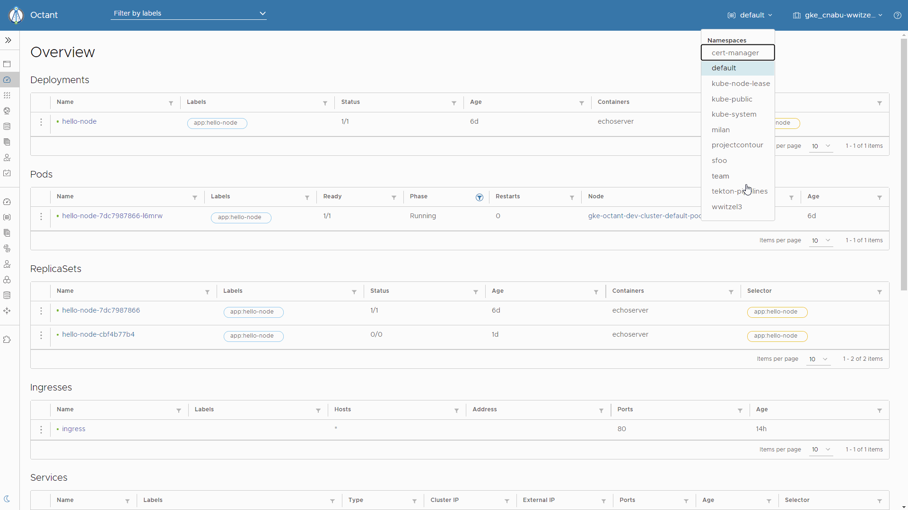

If you are running your applications on [Kubernetes](https://kubernetes.io/), whether you have more a development or operation background, there is a high chance that you have to deal with multiple clusters, 
perhaps one cluster for development, one cluster for user acceptance and one cluster for production.
It can be even more if you are doing multi cloud and on premise deployments.  
There are also companies that setups different clusters per team.

Whatever your setup, it's important to be able to switch easily between clusters.

If you're not very familiar with Kubernetes - if you have more a development background for example - you may prefer to use higher level and easier to use tools than the official [kubectl](kubectl) client,
although it is very well documented and so you should be able to get used to it after some practice and heavy use of `kubectl help` and `kubectl help <command>`.

But in order to use higher level tools, you first need to understand how `kubectl` uses `kubeconfig` files to configure the connection for one Kubernetes cluster and how to switch to another cluster because every higher level tools use the same `kubeconfig`.
It also means that if `kubectl` can interact with your cluster, higher level tool will more likely work too and if they don't, you can exclude `kubeconfig` from your checklist :smirk:.

## Kubectl

The [kubectl](kubectl) command line tool lets you control Kubernetes clusters. 
For configuration, kubectl looks by default for a file named config in the `$HOME/.kube` directory. 
But you can specify other kubeconfig files by setting the `KUBECONFIG` environment variable or by setting the `--kubeconfig` flag.

Assuming you have the certificate to connect to a kubernetes API located at https://foo.kubernetes.com, you can configure `kubectl` as followed:

```sh
# configure user kubeuser. kubeuser/foo.kubernetes.com is a naming convention that you can follow or not but it's good practice
kubectl config set-credentials kubeuser/foo.kubernetes.com --username=kubeuser --password=kubepassword
# configure cluster foo.kubernetes.com with certificate (recommended)
kubectl config set-cluster foo.kubernetes.com --certificate-authority=~/.kube/foo.kubernetes.com/ca.crt --server=https://foo.kubernetes.com
# or without certificate
kubectl config set-cluster foo.kubernetes.com --insecure-skip-tls-verify=true --server=https://foo.kubernetes.com
# create a context to link the cluster and the credentials with a default namespace 'default'. default/foo.kubernetes.com/kubeuser is a naming convention too.
kubectl config set-context default/foo.kubernetes.com/kubeuser --user=kubeuser/foo.kubernetes.com --namespace=default --cluster=foo.kubernetes.com
# use that context
kubectl config use-context default/foo.kubernetes.com/kubeuser
```

So in summary: 

- in the same kubeconfig file, you can configure:
  - many credentials by executing `kubectl config set-credentials` as many times as necessary
  - many clusters by executing `kubectl config set-cluster` as many times as necessary
  - many contexts by executing `kubectl config set-context` as many times as necessary
- a context is used to link a user and a cluster with a default namespace
- and finally you can switch to another context by executing `kubectl config use-context <context_name>`

The command `kubectl config use-context` update the kubeconfig file by setting `current-context` key to the correct context, therefore this context will be automatically used in all your opened terminals.

In some scenario, lets say you want to compare test and production environment, you may want to have different terminals interacting with different kubernetes clusters. 

For that you can split the kubeconfig into many files as needed and use `KUBECONFIG` environment variable or `--kubeconfig` flag to point to the desired kubeconfig in the current terminal.
For example:

```sh
# setup kubeconfig for all command running in this terminal
export KUBELCONFIG=~/.kube/test-config
# this command will run against test cluster
kubectl get pods
# this command will run against test cluster too
kubectl get services
# however this command will run on production cluster because the flag takes precedence over KUBECONFIG environment variable
kubectl --kubeconfig=~/.kube/production-config get pods
```

For more tips and information on key commands, do not hesitate to look at [kubectl cheatsheet](https://kubernetes.io/docs/reference/kubectl/cheatsheet/). 
Keep in mind that for advanced usage, `kubectl` will rules all other tools as it is the official native client and every new feature is directly implemented in it.

Ok so now that we understand how `kubeconfig` configuration works with `kubectl`, lets see the options we have to simplify our life :relieved:.

## Kubectx and Kubens

Let's first start with [kubectx and kubens](kubectx).

`kubectx` helps you switch between clusters back and forth in a more user friendly and memorable way:

<!-- TODO: replace this with markdown when gatsby-remark-image supports gifs https://github.com/gatsbyjs/gatsby/issues/23678 -->


On the same idea, `kubens` helps you switch between Kubernetes namespaces smoothly using the same kubeconfig context:

<!-- TODO: replace this with markdown when gatsby-remark-image supports gifs https://github.com/gatsbyjs/gatsby/issues/23678 -->


<Tip variant="note">
  These 2 utility tools update the current kubeconfig file, so the configuration is updated for all terminals.
</Tip>

Very simple but yet efficient tools! :sunglasses:

## Stern or Kubetail

**[stern](stern)** and **[kubetail](kubetail)** are 2 similar tools that allow you to `tail` multiple pods and containers within these pods into one single stream in the current kubeconfig context.
Each result is prefixed with a color coded for quicker debugging.

They have sensibly the same with same features, I didn't notice any major feature that one has and not the other.

The main difference is `stern` is written in go and so: 

- the binary is compatible for Linux, Mac and Windows
- but the binary size is ~20MB 

While `kubetail` is a shell application and so:

- the binary size of ~12kb
- it is compatible with Linux and Mac out of the box, but not directly on Windows platform

So just pickup the one you like the most and that works on your platform!

## K9s

Our next tool is k9s:

<Blockquote url="https://github.com/derailed/k9s/" author="k9s">
  <code>k9s</code> provides a terminal UI to interact with your Kubernetes clusters.  
  It makes it easier to navigate, observe and manage your applications in the wild. 
  K9s continually watches Kubernetes for changes and offers subsequent commands to interact with your observed resources.
</Blockquote>

Once it it installed, just run `k9s` in your terminal, it will use the `kubeconfig` file to known on which kubernetes cluster it needs to connect. 
Then you should land to a screen like this one:


Then you have some key mapping to describe, edit, view, view logs, ... depending on which screen you are.
You can also execute a command by hitting `:` followed by your command to see other resources for examples: `pods`, `services`, `deployments`, ...

## Octant

And finally you have [Octant](octant)

<Blockquote url="https://octant.dev/" author="Octant">
  <code>Octant</code> is a highly extensible platform for developers to better understand the complexity of Kubernetes clusters.
  It aims to be part of the developer's toolkit for gaining insight and approaching complexity found in Kubernetes.  
  Octant offers a combination of introspective tooling, cluster navigation, and object management along with a plugin system to further extend its capabilities.
</Blockquote>

In summary, it is an extensible web application that uses your `kubeconfig` to connect and inspect the kubernetes cluster and help you to discover and understand your kubernetes cluster with currently and in my opinion, more advanced features than the [kubernetes dashboard](https://kubernetes.io/docs/tasks/access-application-cluster/web-ui-dashboard/). 
Once installed, you can just run `octant` in a terminal, it will also use the current kubeconfig file to know on which kubernetes cluster it needs to connect:

<!-- TODO: replace this with markdown when gatsby-remark-image supports gifs https://github.com/gatsbyjs/gatsby/issues/23678 -->


You can also add plugins to better understand [custom resources](https://kubernetes.io/docs/concepts/extend-kubernetes/api-extension/custom-resources/) for example.

## Summary

Whether you prefer UI or CLI to manage your kubernetes clusters, at least you need to understand how kubeconfig configurations works under the hood because all other tools rely on it.

We have seen how to manage your kubeconfig in one or many files depending on your use cases and how to switch between context, either globally by updating the current context easily with `kubectx` and `kubens` 
or just locally for the current terminal by updating the `KUBECONFIG` environment variable.

If you're more a CLI user like me, you can then use official `kubectl` with `stern` or `kubetail` for troubleshooting during development/testing (in production you should definetely rely on a centralised logging solution).

For those who find `kubectl` too complex to remember the command but still likes running in a terminal, you can still use `k9s`, allowing you to perform most of common actions.

However if you prefer browsing and manage your cluster with a UI, I would definetely recommend you to have a look at [octant](octant).

[kubectl]: https://www.gatsbyjs.org/
[kubectx]: https://github.com/ahmetb/kubectx/
[stern]: https://github.com/wercker/stern/
[kubetail]: https://github.com/johanhaleby/kubetail/
[k9s]: https://github.com/derailed/k9s/
[octant]: https://octant.dev/